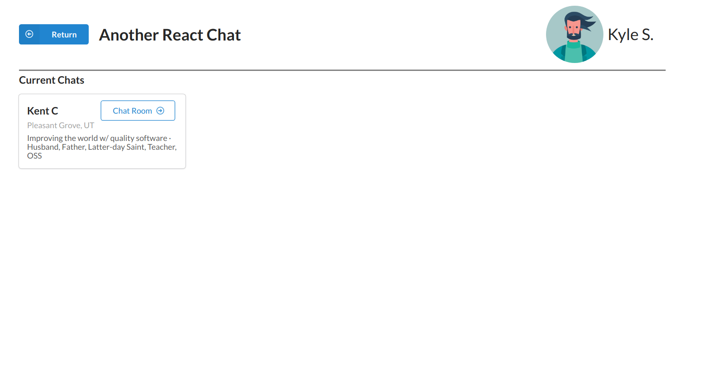

### Full React Chat App

You will find an http server built with nodejs and express and this is using a mongo database. Also in chat project you will find the client for this API.

### Description

My intention here is to create a very basic http server without the need to follow Restfull constraints or anything is just to try nodejs and express features and more important to have fun.
I have coded the client app with the same intentions but I put in there a little more effort than for the server.

Hope you enjoy it.

### Preview

### Reference

Based and inspired on a [nodejs](https://platzi.com/clases/backend-js/) platzi course.
