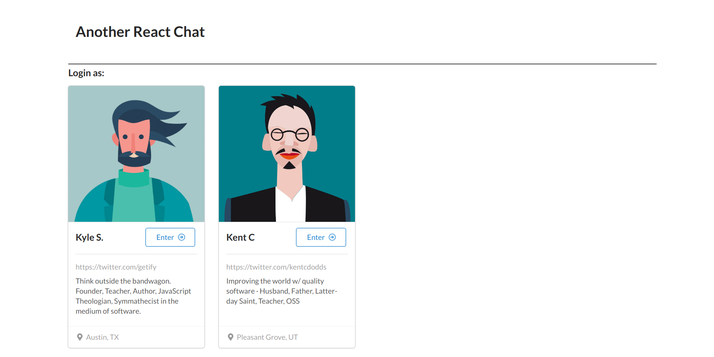
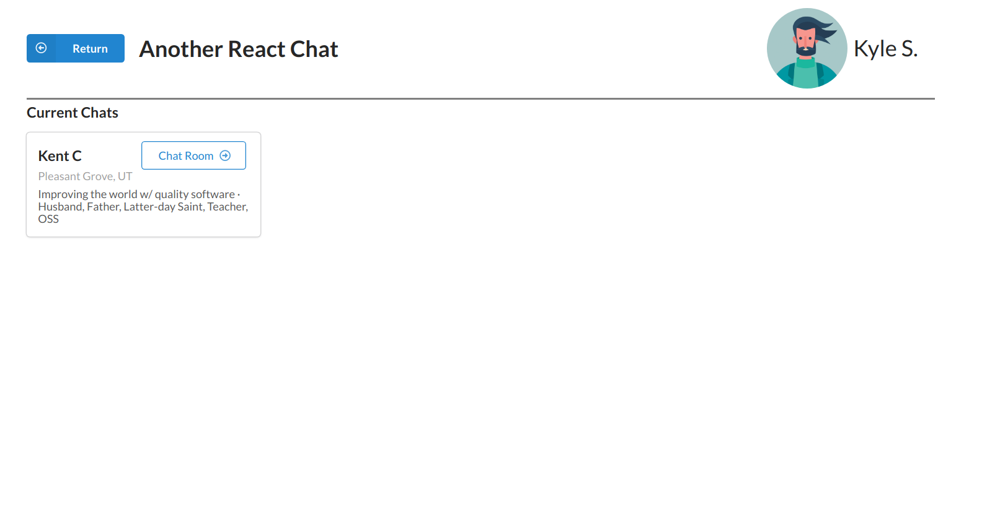
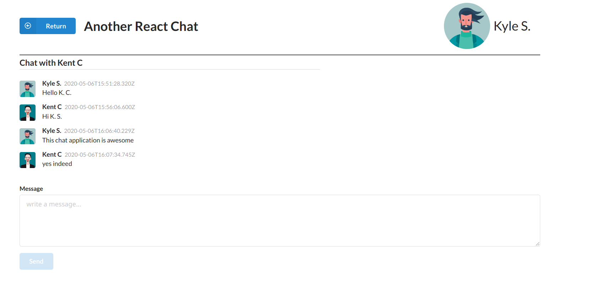

## Express Basic App

This is a very simple express application that has been built just to have fun with nodejs and express.

I deployed this API on heroku, you can take a look at this [link](https://esquinazi-nodejs-react-chat.herokuapp.com/messages) to play around.

### Run it locally

First of all you are going to need a mongo database I used the [mongodb altas](https://www.mongodb.com/cloud/atlas) platform for this. Later you will need to create a user/password in order to connect the server with the DB.

1- Create `.env` file and your variables

```
DB_NAME=core-xyz.gcp.mongodb.net
DB_USER=db_user_value
DB_PASSWORD=db_password_value
```

2- Install node packages and then run

```
npm install
npm run start:dev
```

### Reference

Based on a [nodejs](https://platzi.com/clases/backend-js/) platzi course.

### Full React Chat App

You will find an http server built with nodejs and express and this is using a mongo database. Also in chat project you will find the client for this API.

### Description

My intention here is to create a very basic http server without the need to follow Restfull constraints or anything is just to try nodejs and express features and more important to have fun.
I have coded the client app with the same intentions but I put in there a little more effort than for the server.

Hope you enjoy it.

### Preview





### Reference

Based and inspired on a [nodejs](https://platzi.com/clases/backend-js/) platzi course.
